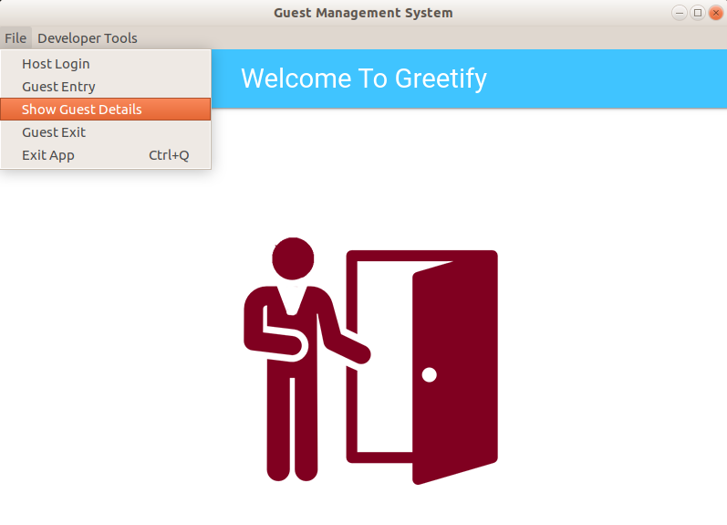
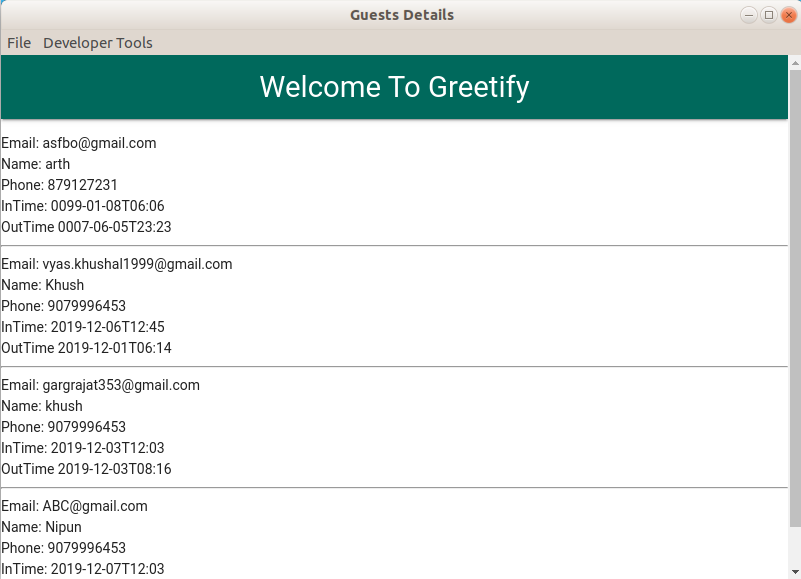
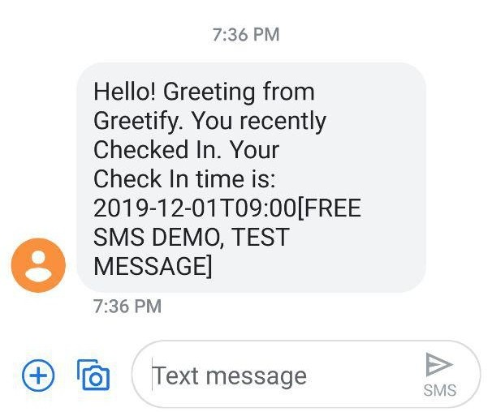

# Greetify


<p align="center">
  
</p>

<p align="center">

</p>

[](https://github.com/codekhal/greetify/issues)
[](https://github.com/codekhal/greetify/network/members)
[](https://github.com/codekhal/greetify/stargazers)


## Index

- [Index](#index)
- [About](#about)
- [Development](#develpoment)
  - [Installation](#installation)
- [File Structure](#file-structure)
- [Guidelines](#guideline)
- [ScreenShots](#screenshots)
- [Present Contributors](#contributors)
- [License](#license)

## About

> Summer SDE-Intern Hiring Challenge [SummerGeeks](https://summergeeks.in/) - Innovaccer

A desktop app build on top of Electron - an open source framework which can be used for creating cross platform desktop native applications. This app handles entry management system for easy office Checkins and Checkouts. This project allows a host and a user to fill in their details and timestamp of their entry is generated automatically. ALso, Database handling for storing and fetching the data is done via [Firebase real-time database system](https://firebase.google.com/docs/database). For mailing and messaging system [Nodemailer](https://nodemailer.com/about/) and [Nexmo api](https://www.nexmo.com/products/sms) respectively is been setup. <br>

## Installation

**Development**

Just want to run the application, you can do is

- Clone the repository

```bash
$ git clone https://github.com/codekhal/greetify.git

```

- Install dependencies by using the following commands.

```bash
$ cd greetify
$ sudo npm install
```
Note: If you want to allow native Nodejs modules to work against the version of Nodejs your electron project is using then

```bash
$ npm install --save-dev electron-rebuild
$ $(npm bin)/electron-rebuild

```
*Add both the above commands to allow electron to work in your Nodejs environment.*

- Get your own API Key & API Secret from [Nexmo API](https://www.nexmo.com/products/sms) for messaging funtionality to work. 

- create a `.env` file in root directory and assign the following environment variables

```bash
$ cd greetify
$ touch .env

$ echo "EMAIL={your email id}" >> .env
$ echo "PASSWORD={your email password}" >> .env
$ echo "NEXMOAPIKEY={your nexmo api key for sms}" >> .env
$ echo "NEXMOAPISECRET={your nexmo api secret for sms}" >> .env
```

- Finally run the application using 

```bash
$ npm start
```  
Note: Add *electron .* inside the start script to run.

## File Structure

- File structure with the basic details about files and directories.

```bash
- __greetify__
  - [LICENSE](greetify/LICENSE)
  - [README.md](greetify/README.md)
  - [addGuest.html](greetify/addGuest.html)
  - [emailClient.js](greetify/emailClient.js)
  - [firebase.js](greetify/firebase.js)
  - [guestDetails.html](greetify/guestDetails.html)
  - [index.html](greetify/index.html)
  - [index.js](greetify/index.js)
  - [loginHost.html](greetify/loginHost.html)
  - __logo__
    - __favicon_io__
      - [favicon.ico](greetify/logo/favicon_io/favicon.ico)
      - [favicon32.png](greetify/logo/favicon_io/favicon32.png)
      - [favicon16.png](greetify/logo/favicon_io/favicon16.png)
    - [greetify.png](greetify/logo/greetify.png)
    - [guest-1.png](greetify/logo/guest-1.png)
  - [node_modules](greetify/node_modules)
  - [list2.md](greetify/list2.md)
  - [package-lock.json](greetify/package-lock.json)
  - [package.json](greetify/package.json)

```
## ScreenShots

<p align="center">
   <br><hr/><br>
   <br><hr/><br>
   <br><hr/><br>
   <br><hr/><br>
   <br><hr/><br>
   <br><hr/><br>
  <br>
</p>


## Guidelines

- __Contribution Guidelines__

Kindly follow the [*Contributions Guildlines*](https://gist.github.com/PurpleBooth/b24679402957c63ec426) before you create any pull requests or issues. Though feel free to contribute in any form. <br> Open Source <3

## Present Contributors
[](https://github.com/codekhal/greetify/graphs/contributors)

- ### Want to share your ideas

`Feel free to reach out to me`

[](https://telegram.me/codekhal)

## License
[](https://github.com/codekhal/greetify/blob/master/LICENSE)
